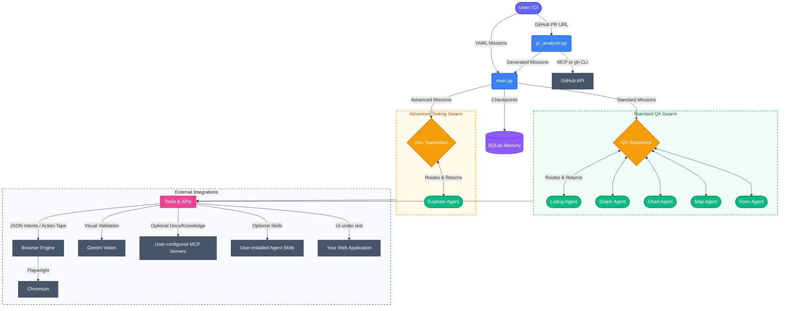

A product-agnostic, AI-driven exploratory test framework that intelligently
explores, tests, and validates **any** web application. Configure it for your stack via a
small `config.yaml`, point it at your app, and let specialized agents drive a real browser
to find bugs, render anomalies, and unscripted edge cases.

Powered by a **LangGraph Swarm** architecture, **Playwright**, and **Google Gemini**, this
framework dynamically routes tasks to UI-pattern specialists, visually validates complex
charts, self-heals from UI errors, optionally consults user-provided MCP servers and Agent
Skills for domain knowledge, generates reproducible Playwright test scripts from every bug
found, and writes Markdown executive test reports.

It can also **analyze GitHub Pull Requests** — pass a PR URL and the framework extracts the
code diff, feeds it to an LLM, and auto-generates targeted test missions covering the UI
areas most likely impacted by the changes.

---

## 🏗️ Architecture

The framework is built on a **Supervisor-Worker Swarm** pattern. Based on the mission type
(determined by the `thread_id` keyword), the system spins up either a **Standard** or
**Advanced** routing graph.



### Architecture Details

1. **Mission Dispatcher (`main.py`)**: Loads `missions/*.yaml` files and provisions the
   correct graph network based on `thread_id` naming conventions
   (`explorer` / `chaos` / `autonomous` route to the advanced graph; everything else to the
   standard 5-agent swarm). Can also accept a `--pr-url` to auto-generate missions from a
   GitHub Pull Request via `pr_analyzer.py`.
2. **Supervisor-Worker Flow**: A Supervisor node dynamically evaluates the workspace state
   and dispatches control to specialized worker nodes.
3. **Record-and-Translate Browser Engine** (`src/agentic_explorer/tools/browser/engine.py`):
   Agents are the *brain*—they never touch the browser directly. Instead they emit strict
   JSON intents to `execute_browser_command`. The engine:
   - Validates selectors against a resilience policy (rejects XPath / positional CSS at
     runtime).
   - Executes the command with Playwright and captures an Accessibility Tree / DOM
     snapshot.
   - Appends every command to an immutable **Action Tape**
     (`report_<thread_id>/action_tape.jsonl`).
   - On bug detection, `generate_reproduction_spec` translates the tape into a runnable
     `reproduction_*.spec.ts` Playwright test.
4. **Tool Modality**: Agents receive (1) the deterministic browser engine, (2) Gemini Vision
   for perceptual validation, (3) any **MCP servers you configure** in
   `mcp_servers.json`, and (4) any **Agent Skills** installed under `AGENT_SKILLS_ROOT`.
   The framework ships zero hardcoded MCP servers or skills — bring your own.
5. **State & Memory (`agent_memory.sqlite`)**: An asynchronous SQLite checkpointer
   remembers agent states (including the `action_tape` field), allowing a reused
   `thread_id` to resume precisely where it left off.

### Source Layout

- `src/agentic_explorer/main.py` — CLI entry, swarm graph compiler, transient-error retry
- `src/agentic_explorer/pr_analyzer.py` — PR-driven test scenario generation (GitHub MCP
  server preferred, `gh` CLI fallback)
- `src/agentic_explorer/auth_setup.py` — generic login flow that saves `auth.json`
- `src/agentic_explorer/config.py` — `config.yaml` loader (with `${ENV}` interpolation)
- `src/agentic_explorer/orchestration/standard_graph.py` — 5 UI-pattern specialist agents
- `src/agentic_explorer/orchestration/advanced_graph.py` — autonomous explorer agent
- `src/agentic_explorer/tools/browser/engine.py` — Record-and-Translate browser engine
- `src/agentic_explorer/tools/common/custom_tools.py` — vision, screenshot, MCP loader,
  Skills tools

---

## ✨ Key Features

* **Product-Agnostic**: One small `config.yaml` adapts the framework to any web app.
* **UI-Pattern Specialist Agents**: Five specialists (listing, graph, chart, map, form)
  + an autonomous explorer — each prompted around a UI pattern, not a product feature.
* **Record-and-Translate Engine**: Agents emit JSON intents, the deterministic engine
  executes and records every step to an immutable Action Tape. Every bug automatically
  generates a reproducible `reproduction_*.spec.ts` Playwright script.
* **Resilient Selector Policy (Engine-Enforced)**: `execute_browser_command` rejects
  brittle XPath / positional selectors at runtime, enforcing
  `data-test-subj` → `aria-label` → visible text priority.
* **Self-Healing Browser Execution**: Playwright actions are wrapped to catch uncaught
  exceptions. Errors are returned as natural language so agents can adapt strategies.
* **Visual Validation**: Agents can take screenshots of complex Canvas/SVG elements and
  use Gemini Vision to analyze them for rendering anomalies.
* **Bring-Your-Own MCP**: Plug in any MCP servers via a standard
  `mcp_servers.json` — agents query them for domain knowledge instead of guessing.
* **Bring-Your-Own Skills**: Install Agent Skills (per the
  [agentskills.io](https://agentskills.io/specification) spec) under `AGENT_SKILLS_ROOT`
  and the framework exposes them automatically.
* **PR-Driven Test Generation**: Pass a GitHub PR URL (`--pr-url`) and the framework
  extracts the diff (preferring the GitHub MCP server, falling back to `gh` CLI), sends
  it to an LLM, and auto-generates targeted mission YAML covering the UI areas impacted
  by the code changes. Optionally execute the generated missions immediately with
  `--execute`.
* **Automated Artifact Generation**: Every test produces an isolated folder containing
  raw execution traces, the Action Tape, bug screenshots, reproducible `.spec.ts` files,
  and an executive Markdown report.

---

## 🛠️ Setup

### 1. Dependencies

Python 3.11+ is required. A virtual environment is highly recommended.

```bash
python -m venv venv
source venv/bin/activate

pip install -r requirements.txt
# Or with uv:
# uv sync

# Install the Playwright Chromium browser
playwright install chromium
```

### 2. Environment Variables

Copy `.env.example` → `.env` and fill in your values:

```env
GOOGLE_API_KEY="your_gemini_api_key_here"

APP_URL="https://your-app.example.com"
APP_USERNAME="your_user"
APP_PASSWORD="your_password"

APP_CONFIG="./config.yaml"
MCP_SERVERS_CONFIG="./mcp_servers.json"

AGENT_SKILLS_ROOT="./agent-skills"
AGENT_SKILL_SCRIPT_TIMEOUT="60"

# Optional: Override the model used for PR scenario generation (defaults to GEMINI_MODEL)
# GEMINI_SCENARIO_MODEL="gemini-2.5-pro"
```

### 3. App Configuration

Copy `config.yaml.example` → `config.yaml` and customize for your application:

```yaml
app:
  name: "My Web Application"
  url: ${APP_URL}
  description: "Brief description used to give agent prompts domain context."

auth:
  method: form
  selectors:
    username: 'input[name="username"]'
    password: 'input[name="password"]'
    submit:   'button[type="submit"]'
  post_login_check: 'a[href="/home"]'   # selector that confirms login worked

paths:
  mcp_servers: ./mcp_servers.json
  skills_root: ./agent-skills
```

### 4. (Optional) MCP Servers

Copy `mcp_servers.json.example` → `mcp_servers.json` and list any MCP servers you want
the agents to consult. Format follows the standard Claude Desktop / Code shape:

```json
{
  "mcpServers": {
    "github": {
      "transport": "http",
      "url": "https://api.githubcopilot.com/mcp/"
    },
    "my-docs": {
      "transport": "http",
      "url": "https://my-docs.example.com/_mcp/"
    }
  }
}
```

The **`github` entry** is used by the PR analyzer (`--pr-url`) to fetch PR data via MCP
tools (`get_pull_request`, `get_pull_request_diff`, `get_pull_request_files`). If not
configured, the analyzer falls back to the `gh` CLI.

If the file is missing or empty, agents simply run without MCP tools.

### 5. (Optional) Agent Skills

Install any Skills (per [agentskills.io](https://agentskills.io/specification)) under
the directory pointed at by `AGENT_SKILLS_ROOT` (default `./agent-skills/`). The framework
discovers them automatically and exposes `fetch_agent_skill` and `run_agent_skill_script`
to agents. If the directory is missing the framework just logs an info message.

### 6. Authenticate

Generate a reusable `auth.json` cookie file so subsequent runs can skip the login screen:

```bash
agent-auth
```

The auth flow uses the selectors defined in `config.yaml > auth`. Adjust them to match
your app's login form.

---

## 🚀 Usage

### Defining Missions

Missions live in `missions/*.yaml`. See [`missions/README.md`](missions/README.md) for the
schema and writing guide. Two templates ship in the repo:

- [`missions/smoke.yaml`](missions/smoke.yaml) — five generic UI-pattern smoke tests
- [`missions/autonomous_exploration.yaml`](missions/autonomous_exploration.yaml) — chaos
  exploration

Both contain placeholders (`<YOUR_APP>`, `<APP_URL>`, `<example_search_term>`, …) — fill
them in for your application before running.

### Running Missions from YAML

```bash
# Standard 5-agent UI swarm
agent-explorer --missions missions/smoke.yaml

# Autonomous exploration (visible browser recommended)
agent-explorer --missions missions/autonomous_exploration.yaml --headed

# Clear agent memory to restart fresh
agent-explorer --missions missions/smoke.yaml --clear-memory

# Override the supervisor step limit (default: 30)
agent-explorer --missions missions/smoke.yaml --max-steps 50
```

### PR-Driven Test Generation

Generate targeted test scenarios from a GitHub Pull Request.

The analyzer **prefers the GitHub MCP server** when a `"github"` entry exists in
`mcp_servers.json` (see setup above). If the MCP server is not configured or unreachable,
it **falls back to the [`gh` CLI](https://cli.github.com/)** (must be installed and
authenticated via `gh auth login`).

```bash
# Generate missions only (writes missions/pr_123.yaml)
agent-explorer --pr-url https://github.com/org/repo/pull/123

# Generate and execute immediately
agent-explorer --pr-url https://github.com/org/repo/pull/123 --execute --headed

# Write generated missions to a custom directory
agent-explorer --pr-url https://github.com/org/repo/pull/123 --output-dir ./pr-missions

# Combine with existing missions
agent-explorer --missions missions/smoke.yaml --pr-url https://github.com/org/repo/pull/123 --execute
```

The analyzer extracts the PR title, description, file list, and full code diff, then sends
them along with the app context from `config.yaml` to an LLM. The LLM maps the changes to
the agent specializations (listing, graph, chart, map, form, explorer) and generates 3-8
targeted missions with specific, actionable prompts. Generated mission files follow the same
YAML format as hand-written ones and can be re-run later with `--missions`.

---

## 📊 Test Artifacts

For every mission, the framework generates a `report_<thread_id>/` directory containing:

1. **`traces.log`** — Full audit trail of every thought, plan, and tool invocation.
2. **`test_report.md`** — Concise executive summary generated by the LLM (objective,
   actions, bugs, Action Tape stats, PASS/FAIL).
3. **`action_tape.jsonl`** — Line-delimited JSON log of every deterministic browser
   command. The source for reproduction scripts.
4. **`reproduction_*.spec.ts`** — Auto-generated Playwright TypeScript tests, one per bug
   detected. Run with:
   ```bash
   npx playwright test report_<thread_id>/reproduction_*.spec.ts --headed
   ```
5. **`screenshots/`** — Image evidence captured on every detected bug.

---

## 🤖 Guide for Autonomous Agents

If you are an AI coding assistant contributing to this repository, see [`AGENTS.md`](AGENTS.md)
for the conventions covering agent registration, selector policy, and tool behavior.

---

## 📄 License

This project is licensed under the MIT License. See [`LICENSE`](LICENSE) for details.

