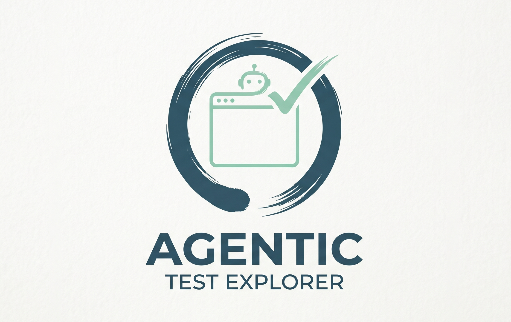
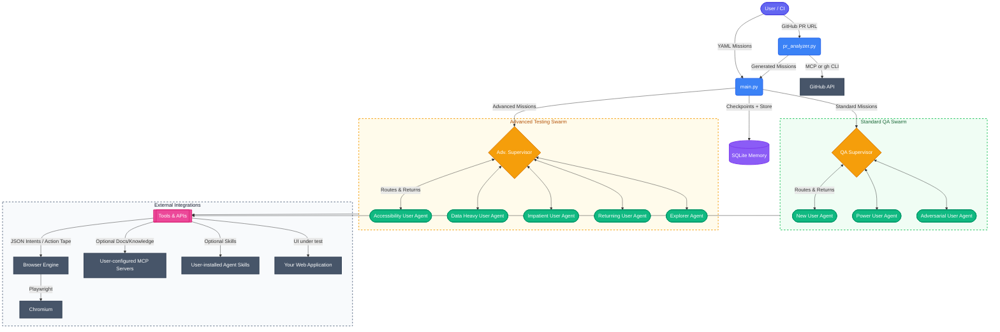

A product-agnostic, AI-driven exploratory test framework that intelligently
explores, tests, and validates **any** web application. Configure it for your stack via a
small `config.yaml`, point it at your app, and let specialized agents drive a real browser
to find bugs, render anomalies, and unscripted edge cases.

Powered by a **LangGraph Swarm** architecture, **Playwright**, and your choice of
**Claude** (default) or **Google Gemini**, this framework dynamically routes tasks to
behavioral QA personas and advanced stress/exploration agents, self-heals from UI errors,
optionally consults user-provided MCP servers and Agent Skills for domain knowledge,
generates reproducible Playwright test scripts from every bug found, and writes Markdown
executive test reports.

It can also **analyze GitHub Pull Requests** — pass a PR URL and the framework extracts the
code diff, feeds it to an LLM, and auto-generates targeted test missions covering the UI
areas most likely impacted by the changes.

---

## 🎬 Demo

<video src="https://github.com/srbarrios/agentic-test-explorer/assets/demo.mov" controls width="100%"></video>

---

## 🏗️ Architecture

The framework is built on a **Supervisor-Worker Swarm** pattern. Based on the mission type
(determined by the `thread_id` keyword), the system spins up either a **Standard** or
**Advanced** routing graph.



### Architecture Details

1. **Mission Dispatcher (`main.py`)**: Loads `missions/*.yaml` files and provisions the
   correct graph network based on `thread_id` naming conventions
   (`accessibility`, `data_heavy`, `impatient`, `returning`, `explorer`, `chaos`, or
   `autonomous` route to the advanced graph; everything else to the standard 3-persona
   swarm). Can also accept a `--pr-url` to auto-generate missions from a GitHub Pull
   Request via `pr_analyzer.py`.
2. **Supervisor-Worker Flow**: A Supervisor node dynamically evaluates the workspace state
   and dispatches control to specialized worker nodes.
3. **Record-and-Translate Browser Engine** (`src/agentic_explorer/tools/browser/engine.py`):
   Agents are the *brain*—they never touch the browser directly. Instead they emit strict
   JSON intents to `execute_browser_command`. The engine:
   - Validates selectors against a resilience policy (rejects XPath / positional CSS at
     runtime).
   - Executes the command with Playwright and captures an Accessibility Tree / DOM
     snapshot.
   - Appends every command to an immutable **Action Tape**
     (`report_<thread_id>/action_tape.jsonl`).
   - On bug detection, `generate_reproduction_spec` translates the tape into a runnable
     `reproduction_*.spec.ts` Playwright test.
4. **Tool Modality**: Agents receive (1) the deterministic browser engine, (2) screenshot
   capture and reproduction-generation tools, (3) any **MCP servers you configure** in
   `mcp_servers.json`, and (4) any **Agent Skills** installed under `AGENT_SKILLS_ROOT`.
   The framework ships zero hardcoded MCP servers or skills — bring your own.
5. **State & Memory (`agent_memory.sqlite`)**: An asynchronous SQLite checkpointer
   remembers agent states (including the `action_tape` field), allowing a reused
   `thread_id` to resume precisely where it left off. A companion **LangGraph Store**
   (optionally configured with an embedding index for semantic search) provides four
   levels of cross-session memory, with LLM-driven operations powered by **Langmem**:
   - **Semantic** — page knowledge, selector reliability, application quirks, plus
     Langmem-managed agent observations (via `record_observation` tool)
   - **Episodic** — session summaries, deduplicated bug catalog
   - **Procedural** — self-improving agent prompts and routing rules optimized via
     Langmem's `create_prompt_optimizer`
   - **Prioritization** — risk-scored page ranking injected into supervisor routing

   Agents can query past findings at runtime via the `recall_past_findings` tool,
   which uses semantic search when an embedding index is configured and falls back to
   keyword matching otherwise. Agents can also proactively record observations via the
   `record_observation` tool (powered by Langmem's `create_manage_memory_tool`).
   The supervisor receives a `MEMORY_CONTEXT` section with known pages, bugs, quirks,
   agent observations, and high-risk areas on every routing cycle.

### Source Layout

- `src/agentic_explorer/main.py` — CLI entry, swarm graph compiler, transient-error retry
- `src/agentic_explorer/pr_analyzer.py` — PR-driven test scenario generation (GitHub MCP
  server preferred, `gh` CLI fallback)
- `src/agentic_explorer/auth_setup.py` — generic login flow that saves `auth.json`
- `src/agentic_explorer/config.py` — `config.yaml` loader (with `${ENV}` interpolation)
- `src/agentic_explorer/utils/llm.py` — `make_llm()` multi-provider factory; supports
  Claude (API key / Vertex AI) and Gemini (API key / OAuth) with auto-detection
- `src/agentic_explorer/utils/llm_json.py` — YAML/JSON extraction helpers for LLM responses
- `src/agentic_explorer/orchestration/graph_base.py` — shared graph infrastructure
  (`AgentState`, node factories, tool filtering)
- `src/agentic_explorer/orchestration/standard_graph.py` — 3 standard QA personas
- `src/agentic_explorer/orchestration/advanced_graph.py` — 4 advanced personas plus autonomous explorer
- `src/agentic_explorer/memory.py` — cross-session memory: semantic (pages, selectors,
  quirks, Langmem-managed agent observations), episodic (session summaries, bug catalog),
  procedural (self-improving prompts via Langmem prompt optimizer), semantic-search recall
  tool, proactive observation tool, regression mission generation, app model export, test
  prioritization
- `src/agentic_explorer/tools/browser/engine.py` — Record-and-Translate browser engine
- `src/agentic_explorer/tools/common/custom_tools.py` — screenshot, MCP loader,
  Skills tools
- `src/agentic_explorer/ui/state_emitter.py` — non-blocking state bridge for Visual Mode
- `src/agentic_explorer/ui/swarm_diagram.py` — Mermaid diagram generator
- `src/agentic_explorer/ui/dashboard.py` — Streamlit dashboard app

---

## ✨ Key Features

* **Product-Agnostic**: One small `config.yaml` adapts the framework to any web app.
* **Persona-Driven QA Agents**: Three standard QA personas plus five advanced agents —
  each prompted around a specific testing strategy.
* **Record-and-Translate Engine**: Agents emit JSON intents, the deterministic engine
  executes and records every step to an immutable Action Tape. Every bug automatically
  generates a reproducible `reproduction_*.spec.ts` Playwright script.
* **Resilient Selector Policy (Engine-Enforced)**: `execute_browser_command` rejects
  brittle XPath / positional selectors at runtime, enforcing
  `data-test-subj` → `aria-label` → visible text priority.
* **Self-Healing Browser Execution**: Playwright actions are wrapped to catch uncaught
  exceptions. Errors are returned as natural language so agents can adapt strategies.
* **Screenshot Evidence**: Agents capture full-page screenshots when bugs or anomalies are
  detected, then generate reproducible Playwright specs from the Action Tape.
* **Bring-Your-Own MCP**: Plug in any MCP servers via a standard
  `mcp_servers.json` — agents query them for domain knowledge instead of guessing.
* **Bring-Your-Own Skills**: Install Agent Skills (per the
  [agentskills.io](https://agentskills.io/specification) spec) under `AGENT_SKILLS_ROOT`
  and the framework exposes them automatically.
* **Cross-Session Learning**: A four-level memory system (semantic, episodic, procedural,
  prioritization) powered by **Langmem** lets agents learn across sessions. The framework
  remembers page structures, selector reliability, application quirks, agent observations,
  past bugs, and which testing strategies worked. Agent prompts and supervisor routing
  rules self-improve via Langmem's prompt optimizer after each batch. Agents can
  proactively record observations and recall past findings using semantic search.
* **Regression Testing**: Run `--regression` to auto-generate missions from the bug
  catalog — no YAML needed. The framework targets pages with known open bugs and
  historically flaky areas.
* **Application Model Export**: Run `--export-model` to export the discovered application
  structure (pages, selectors with reliability scores, bugs, quirks, session stats) as
  `app_model.json`.
* **PR-Driven Test Generation**: Pass a GitHub PR URL (`--pr-url`) and the framework
  extracts the diff (preferring the GitHub MCP server, falling back to `gh` CLI), sends
  it to an LLM, and auto-generates targeted mission YAML covering the UI areas impacted
  by the code changes. When historical bug data exists, it's injected into the LLM
  prompt for better-targeted missions. Optionally execute the generated missions
  immediately with `--execute`.
* **Automated Artifact Generation**: Every test produces an isolated folder containing
  raw execution traces, the Action Tape, bug screenshots, reproducible `.spec.ts` files,
  and an executive Markdown report.

---

## 🛠️ Setup

### 1. Dependencies

Python 3.11+ is required. A virtual environment is highly recommended.

```bash
# Create and activate a virtual environment (plain venv or uv)
python -m venv .venv
source .venv/bin/activate

# Install the package and all dependencies (editable mode)
pip install -e .

# Or, if you use uv (recommended — much faster):
uv venv
uv pip install -e .

# Optional: Install Visual Mode (Streamlit dashboard)
pip install -e ".[visual]"
# Or with uv:
uv pip install -e ".[visual]"

# Install the Playwright Chromium browser
playwright install chromium
```

> **Keeping dependencies up to date:** After pulling new changes, always re-sync your
> virtual environment to pick up any added or updated packages:
>
> ```bash
> # pip
> pip install -e .
>
> # uv
> uv pip install -e .
> ```

### 2. Environment Variables

Copy `.env.example` → `.env` and fill in your values. The framework supports two LLM
providers — **Claude** (default) and **Gemini** — and auto-detects which to use from
available credentials.

```env
# --- LLM Provider (optional — auto-detected from credentials if not set) ---
# LLM_PROVIDER="claude"         # or: gemini

# --- Claude authentication (default provider — choose one) ---

# Option A: Direct API key
ANTHROPIC_API_KEY="your_anthropic_api_key_here"

# Option B: Vertex AI (zero config if you already use Claude Code)
# The framework reads ~/.claude/settings.json automatically. If it contains
# CLAUDE_CODE_USE_VERTEX=1 and ANTHROPIC_VERTEX_PROJECT_ID, Claude on Vertex
# AI is used with no additional setup.

# --- Gemini authentication (alternative provider — choose one) ---

# Option A: API key
# GOOGLE_API_KEY="your_gemini_api_key_here"

# Option B: OAuth credentials (no env var needed)
# If GOOGLE_API_KEY is not set, the framework loads ~/.gemini/oauth_creds.json
# produced by: gemini auth login

# --- Application under test ---
APP_URL="https://your-app.example.com"
APP_USERNAME="your_user"
APP_PASSWORD="your_password"

APP_CONFIG="./config.yaml"
MCP_SERVERS_CONFIG="./mcp_servers.json"

AGENT_SKILLS_ROOT="./agent-skills"
AGENT_SKILL_SCRIPT_TIMEOUT="60"
```

**Provider auto-detection order** (when `LLM_PROVIDER` is not set):

| Priority | Credential Source | Provider |
|----------|-------------------|----------|
| 1 | `ANTHROPIC_API_KEY` env var | Claude (direct API) |
| 2 | `~/.claude/settings.json` with `CLAUDE_CODE_USE_VERTEX=1` | Claude (Vertex AI) |
| 3 | `GOOGLE_API_KEY` env var | Gemini (API key) |
| 4 | `~/.gemini/oauth_creds.json` | Gemini (OAuth) |

**Smart model defaults** — the framework picks the best model for your auth method:

| Auth Method | Default Model | Rationale |
|-------------|---------------|-----------|
| Claude API key | `claude-haiku-4-5` | Fast, economical |
| Claude Vertex AI | `claude-haiku-4-5` | Fast, economical |
| Gemini API key | `gemini-3.1-flash-lite` | Fast, economical |
| Gemini OAuth | `gemini-3.1-flash-lite` | Fast, economical |

Override models via env vars (`CLAUDE_MODEL`, `GEMINI_MODEL`) or in `config.yaml` (see below).

### 3. App Configuration

Copy `config.yaml.example` → `config.yaml` and customize for your application:

```yaml
app:
  name: "My Web Application"
  url: ${APP_URL}
  description: "Brief description used to give agent prompts domain context."

auth:
  method: form
  selectors:
    username: 'input[name="username"]'
    password: 'input[name="password"]'
    submit:   'button[type="submit"]'
  post_login_check: 'a[href="/home"]'   # selector that confirms login worked

paths:
  mcp_servers: ./mcp_servers.json
  skills_root: ./agent-skills

# LLM provider (optional — auto-detected from credentials by default)
llm:
  # provider: claude              # or: gemini
  # claude_model: claude-sonnet-4-6
  # claude_vision_model: claude-haiku-4-5
  # gemini_model: gemini-3.1-flash-lite
  # gemini_vision_model: gemini-3.1-flash-lite

  # Embedding model for semantic search in long-term memory (optional).
  # When configured, recall_past_findings uses vector similarity instead of
  # keyword matching.  Gemini users can use their existing API key; Claude
  # users can run a local model via Ollama.
  # embedding_model: google-genai:models/embedding-001   # Gemini (768d)
  # embedding_dims: 768
  # embedding_model: ollama:nomic-embed-text             # Ollama local (768d)
  # embedding_dims: 768
```

### 4. (Optional) MCP Servers

Copy `mcp_servers.json.example` → `mcp_servers.json` and list any MCP servers you want
the agents to consult. Format follows the standard Claude Desktop / Code shape:

```json
{
  "mcpServers": {
    "github": {
      "transport": "http",
      "url": "https://api.githubcopilot.com/mcp/"
    },
    "my-docs": {
      "transport": "http",
      "url": "https://my-docs.example.com/_mcp/"
    }
  }
}
```

The **`github` entry** is used by the PR analyzer (`--pr-url`) to fetch PR data via MCP
tools (`get_pull_request`, `get_pull_request_diff`, `get_pull_request_files`). If not
configured, the analyzer falls back to the `gh` CLI.

If the file is missing or empty, agents simply run without MCP tools.

### 5. (Optional) Agent Skills

Install any Skills (per [agentskills.io](https://agentskills.io/specification)) under
the directory pointed at by `AGENT_SKILLS_ROOT` (default `./agent-skills/`). The framework
discovers them automatically and exposes `fetch_agent_skill` and `run_agent_skill_script`
to agents. If the directory is missing the framework just logs an info message.

### 6. Authenticate

Generate a reusable `auth.json` cookie file so subsequent runs can skip the login screen:

```bash
agent-auth
```

The auth flow uses the selectors defined in `config.yaml > auth`. Adjust them to match
your app's login form.

---

## 📊 Visual Mode (Real-Time Dashboard)

The framework includes an optional **Visual Mode** — a Streamlit-based real-time dashboard that displays live browser screenshots, swarm state diagrams, thought streams, and action tapes while missions execute.

### Architecture: The Spectator Pattern

Visual Mode uses a **one-way "spectator" architecture** with zero performance overhead:

```
Main Process (LangGraph)          Streamlit Dashboard
┌─────────────────────┐          ┌──────────────────┐
│ Supervisor → Agent  │──JSON──▶ │ Polls every ~1s: │
│ Playwright engine   │──JPEG──▶ │  .agent_state.json│
│ (fire-and-forget)   │          │  .latest_vision.jpg│
└─────────────────────┘          └──────────────────┘
```

The main process writes state atomically to `.agent_state.json` and async screenshots to `.latest_vision.jpg`. The dashboard polls these files. No IPC, no callbacks, no blocking.

### Installation

Visual Mode requires Streamlit as an optional dependency:

```bash
# Install with visual mode support
pip install -e ".[visual]"

# Or with uv:
uv pip install -e ".[visual]"
```

### Usage

Add the `--visual` flag to any mission:

```bash
# Standard mission with visual mode
agent-explorer --missions missions/new_user_agent.yaml --visual

# Visual mode with headed browser (recommended for debugging)
agent-explorer --missions missions/explorer_agent.yaml --headed --visual

# PR-driven testing with visual mode
agent-explorer --pr-url https://github.com/org/repo/pull/123 --execute --visual

# Regression testing with visual mode
agent-explorer --regression --headed --visual
```

The Streamlit dashboard will automatically open in your default browser at `http://localhost:8501`. If it doesn't open automatically, navigate to that URL manually.

### Dashboard Features

The dashboard provides four key views:

- **Sidebar**: Mission ID, graph type (standard/advanced), LLM provider, and live metrics (steps, bugs, explored paths)
- **Live Browser Vision**: Real-time JPEG screenshots of the Playwright viewport, updated after each browser command
- **Swarm State Diagram**: Interactive Mermaid diagram showing the Supervisor-Worker topology with the currently active node highlighted in green
- **Tabbed Activity Views**:
  - **Thought Stream**: Latest LLM reasoning from the active agent
  - **Action Tape**: Recent browser commands with execution time and status
  - **Bugs**: Discovered bugs with detailed descriptions and bug count
  - **Paths**: URLs visited during the mission

### Performance Impact

**Zero** when `--visual` is not used — all emission code short-circuits on a single boolean check. When enabled:
- State writes: ~1ms per update (2KB JSON + atomic `os.replace`)
- Screenshots: Fire-and-forget async tasks (JPEG quality 50, ~30-80KB)
- Main process never waits for the dashboard

---

## 🚀 Usage

### Defining Missions

Missions live in `missions/*.yaml`. See [`missions/README.md`](missions/README.md) for the
schema and writing guide. Eight templates ship in the repo, one for each supported agent:

- [`missions/new_user_agent.yaml`](missions/new_user_agent.yaml)
- [`missions/power_user_agent.yaml`](missions/power_user_agent.yaml)
- [`missions/adversarial_user_agent.yaml`](missions/adversarial_user_agent.yaml)
- [`missions/accessibility_user_agent.yaml`](missions/accessibility_user_agent.yaml)
- [`missions/data_heavy_user_agent.yaml`](missions/data_heavy_user_agent.yaml)
- [`missions/impatient_user_agent.yaml`](missions/impatient_user_agent.yaml)
- [`missions/returning_user_agent.yaml`](missions/returning_user_agent.yaml)
- [`missions/explorer_agent.yaml`](missions/explorer_agent.yaml)

All of them contain placeholders (`<YOUR_APP>`, `<APP_URL>`, `<example_search_term>`, …) — fill
them in for your application before running.

### Running Missions from YAML

```bash
# Standard 3-persona QA swarm (uses auto-detected provider — Claude by default)
agent-explorer --missions missions/new_user_agent.yaml

# Explicitly choose a provider
agent-explorer --missions missions/power_user_agent.yaml --provider claude
agent-explorer --missions missions/power_user_agent.yaml --provider gemini

# Advanced persona mission
agent-explorer --missions missions/accessibility_user_agent.yaml --headed

# Autonomous exploration (visible browser recommended)
agent-explorer --missions missions/explorer_agent.yaml --headed

# Clear all memory (checkpoints + learned knowledge) to restart fresh
agent-explorer --missions missions/new_user_agent.yaml --clear-all

# Clear only checkpoints (preserves learned memory: pages, bugs, procedures)
agent-explorer --missions missions/new_user_agent.yaml --clear-checkpoints

# Clear only learned memory (preserves checkpoints for resume)
agent-explorer --missions missions/new_user_agent.yaml --clear-learned

# Override the supervisor step limit (default: 30)
agent-explorer --missions missions/new_user_agent.yaml --max-steps 50

# Suppress verbose ReAct console output (traces.log still captures everything)
agent-explorer --missions missions/new_user_agent.yaml --quiet
```

### Regression Testing & Model Export

```bash
# Auto-generate and run missions targeting known bugs (no --missions needed)
agent-explorer --regression --headed

# Combine regression with manual missions
agent-explorer --missions missions/new_user_agent.yaml --regression

# Export discovered app structure as JSON
agent-explorer --export-model
```

### PR-Driven Test Generation

Generate targeted test scenarios from a GitHub Pull Request.

The analyzer **prefers the GitHub MCP server** when a `"github"` entry exists in
`mcp_servers.json` (see setup above). If the MCP server is not configured or unreachable,
it **falls back to the [`gh` CLI](https://cli.github.com/)** (must be installed and
authenticated via `gh auth login`).

```bash
# Generate missions only (writes missions/pr_123.yaml)
agent-explorer --pr-url https://github.com/org/repo/pull/123

# Generate and execute immediately
agent-explorer --pr-url https://github.com/org/repo/pull/123 --execute --headed

# Write generated missions to a custom directory
agent-explorer --pr-url https://github.com/org/repo/pull/123 --output-dir ./pr-missions

# Combine with existing missions
agent-explorer --missions missions/new_user_agent.yaml --pr-url https://github.com/org/repo/pull/123 --execute
```

The analyzer extracts the PR title, description, file list, and full code diff, then sends
them along with the app context from `config.yaml` to an LLM. The LLM maps the changes to
the remaining standard and advanced personas and generates 3-8 targeted missions with
specific, actionable prompts. Generated mission files follow the same YAML format as
hand-written ones and can be re-run later with `--missions`.

---

## 📊 Test Artifacts

For every mission, the framework generates a `report_<thread_id>/` directory containing:

1. **`traces.log`** — Full audit trail of every thought, plan, and tool invocation.
2. **`test_report.md`** — Concise executive summary generated by the LLM (objective,
   actions, bugs, Action Tape stats, PASS/FAIL).
3. **`action_tape.jsonl`** — Line-delimited JSON log of every deterministic browser
   command. The source for reproduction scripts.
4. **`reproduction_*.spec.ts`** — Auto-generated Playwright TypeScript tests, one per bug
   detected. Run with:
   ```bash
   npx playwright test report_<thread_id>/reproduction_*.spec.ts --headed
   ```
5. **`screenshots/`** — Image evidence captured on every detected bug.

---

## 🤖 Guide for Autonomous Agents

If you are an AI coding assistant contributing to this repository, see [`AGENTS.md`](AGENTS.md)
for the conventions covering agent registration, selector policy, and tool behavior.

---

## 📄 License

This project is licensed under the MIT License. See [`LICENSE`](LICENSE) for details.

